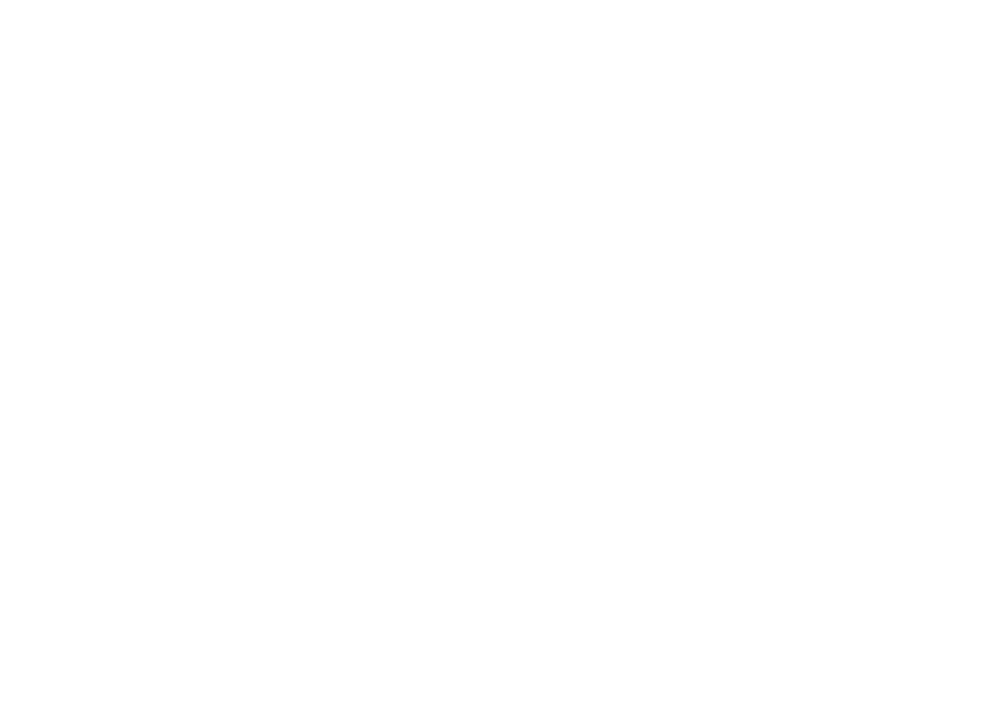

    

The Bug-Tracker application is a ticket management system that enables a group of users to effectively track issues. This application enables users to create, modify and remove tickets. Users can also add comments to tickets as well as check ticket history. This application includes additional features such as authorization, user role assignment, and problem management. Feel free to check out my project at [https://bug-tracker.dev](https://bug-tracker.dev)
